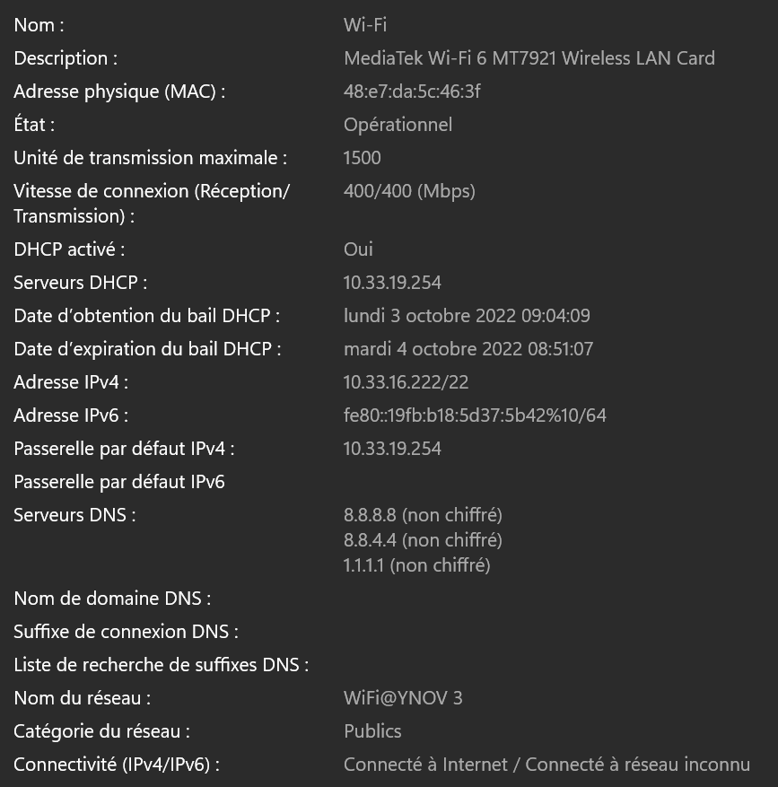
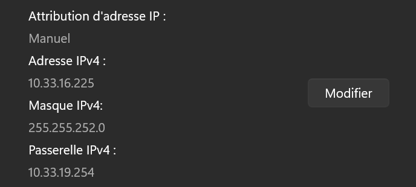
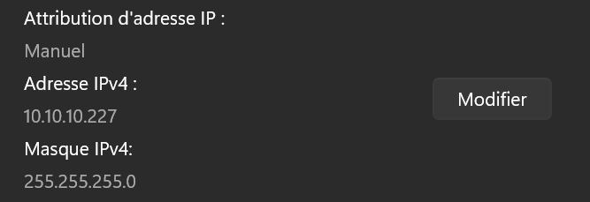
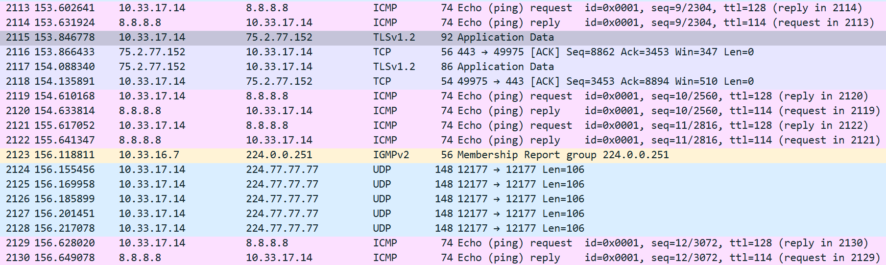
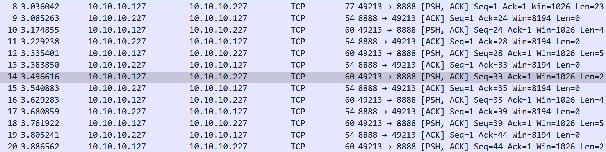
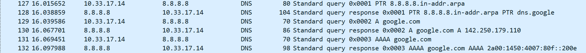

# Tp 1 Réseau

## I. Explotation local Solo 

#### *1.  Affichage d'informations sur la pile TCP/IP locale*

**Affichez les infos des cartes réseau de votre PC:**

`Command : ipconfig /all`
    
Carte réseau sans fil Wi-Fi, 48-E7-DA-5C-46-3F, 10.33.16.222.

Carte Ethernet Ethertnet, 04-42-1A-89-B3-1A, pas IP comme pas connecter.

**Affichez votre gateway :**

`command : ipconfig /all`

IP Passerelle, 10.33.19.254

**Déterminer la MAC de la passerelle :**

`command : arp -a`

MAC, 00-c0-e7-e0-04-4e

**Trouvez comment afficher les informations sur une carte IP :**
 
 Dans les paramètres, Réseau et internet, Paramètres réseau avancés, Propiétés du matériel et de la connexion.
 

#### *2. Modifcations des informations*

*A. Modification d'adresse IP*

**Modification d'adresse IP**

Dans les paramètres, Réseau et internet, Wi-fi, Propiétés du matériel, Attribution d'adresse IP, Modifier .

**Il est possible que vous perdiez l'accès internet. Pourquoi ?** 

Si l'on prend une adresse déjà attribuée cela nous déconnectera du Wifi car elle est déjà utilisée.

## II. Exploration locale en duo

#### *1. Prérequis*

`Fait`

#### *2. Câblage*

`Fait`

#### *3. Modification d'adresse IP*

**Modifiez l'IP des deux machines pour qu'elles soient dans le même réseau :**

Dans les paramètres, Réseau et internet, Ethernet, Attribution d'adresse IP, Modifier .

**Vérifier à l'aide d'une commande que votre IP a bien été changée :**

`command : ipconfig /all`

Carte Ethernet Ethertne, 10.10.10.227.

**Vérifier que les deux machines se joignent :**

`command : ping 10.10.10.227`

réponse : 

`Réponse de 10.10.10.127 : octets=32 temps<1ms TTL=128`

**Déterminer l'adresse MAC de votre correspondant**

`command : arp 10.10.10.127 -a`

réponse : 
 
`10.10.10.127, 08-8f-c3-0a-24-53`

#### *4. Utilisation d'un des deux comme gateway*

**Tester l'accès internet :**

`ping 1.1.1.1`

Réponse : 

`Réponse de 1.1.1.1 : octets=32 temps=99 ms TTL=113`

**Prouver que la connexion Internet passe bien par l'autre PC :**

`tracert -d 10.10.10.127`

Réponse : 

    Détermination de l’itinéraire vers 10.10.10.127 avec un maximum de 30 sauts.
    1     1 ms     1 ms     2 ms  10.10.10.127
    
#### *5. Petit chat privé*

**sur le PC serveur :**

    PS C:\Users\samyd\OneDrive\Bureau\netcat-win32-1.11\netcat-1.11> .\nc.exe -l -p 8888
    pong
    ping

**sur le PC client :**

    PS C:\Users\33603\Downloads\netcat-1.11> .\nc.exe 10.10.10.227 8888
    ping
    pong
    
**Visualiser la connexion en cours :**

    TCP    10.10.10.227:8888      10.10.10.127:63479     ESTABLISHED
    [nc.exe]
    
**Pour aller un peu plus loin :**

    PS C:\Users\samyd\OneDrive\Bureau\netcat-win32-1.11\netcat-1.11> .\nc.exe -l -p 8888 -s 10.10.10.127
    Can't grab 10.10.10.127:8888 with bind
    
#### *6. Firewall*

**Activez et configurez votre firewall**

Dans les paramêtres avancer du pare feu et active la règle du "Partage de fichiers et d’imprimantes (Demande d’écho - Trafic entrant ICMPv4)" (en entrer et en sortie)

Dans les paramêtres avancer du pare feu et créer une nouvelle règle en port, en TC, et port spéc : 8888 (en entrer et en sortie)

## III. Manipulations d'autres outils/protocoles côté client

#### *1. DHCP*

**Exploration du DHCP, depuis votre PC**

      Serveur DHCP . . . . . . . . . . . . . : 10.33.19.254
      Adresse IPv4. . . . . . . . . . . . . .: 10.33.17.14(préféré)
      Bail obtenu. . . . . . . . . . . . . . : jeudi 6 octobre 2022 09:04:36
      Bail expirant. . . . . . . . . . . . . : vendredi 7 octobre 2022 09:04:33
     
#### *2. DNS*

**Trouver l'adresse IP du serveur DNS que connaît votre ordinateur**

      Serveurs DNS. . .  . . . . . . . . . . : 8.8.8.8
                                               8.8.4.4
                                               1.1.1.1
 
                            
**Utiliser, en ligne de commande l'outil nslookup (Windows, MacOS) ou dig (GNU/Linux, MacOS) pour faire des requêtes DNS à la main**

google.com:

    nslookup google.com
    Serveur :   dns.google
    Address:  8.8.8.8
    
    Réponse ne faisant pas autorité :
    Nom :    google.com
    Addresses:  2a00:1450:4007:80f::200e
          216.58.214.174 

ynov.com:

    nslookup ynov.com
    Serveur :   dns.google
    Address:  8.8.8.8

    Réponse ne faisant pas autorité :
    Nom :    ynov.com
    Addresses:  2606:4700:20::ac43:4ae2
          2606:4700:20::681a:be9
          2606:4700:20::681a:ae9
          104.26.11.233
          172.67.74.226
          104.26.10.233  
          
Pour les deux demandes c'esr au serveur dns.google a l'adresse 8.8.8.8

La command va interroger le serveur dns.google , pour avoir les adresse des noms de domaine demander.

231.34.113.12:

    nslookup 231.34.113.12
    Serveur :   dns.google
    Address:  8.8.8.8

    *** dns.google ne parvient pas à trouver 231.34.113.12 : Non-existent domain

78.34.2.17:

    nslookup 78.34.8.17
    Serveur :   dns.google
    Address:  8.8.8.8

    Nom :    cable-78-34-8-    17.nc.de
    Address:  78.34.8.17

Pour cette fois il interroge le serveur dns.google si il connait un nom de domaine pour les adresse Ip demander.
Pour l'adresse 231.34.113.12, l'adresse n'est pas attribuer donc il nous renvoie une erreur.

## IV. Wireshark

#### *1. Intro Wireshark*

**Utilisez le pour observer les trames qui circulent entre vos deux carte Ethernet. Mettez en évidence :**

ping : 

    
netcat :

DNS : 

#### *2. Bonus : avant-goût TCP et UDP*

**Wireshark it**

Mon pc ce connecte a l'ip 216.58.201.238 et au port 443 quand je regarde une video youtube